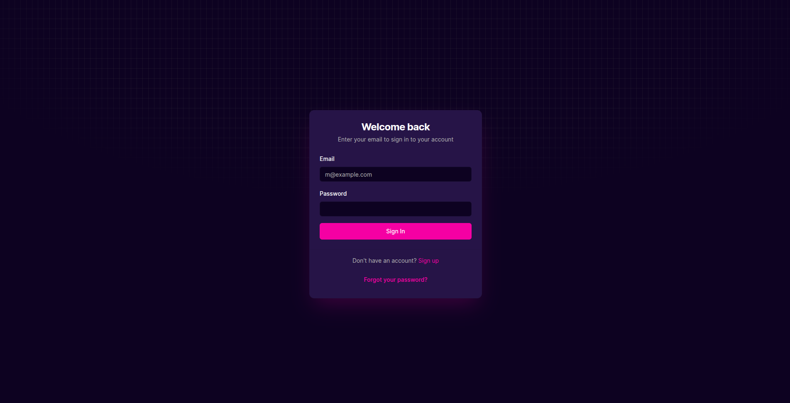
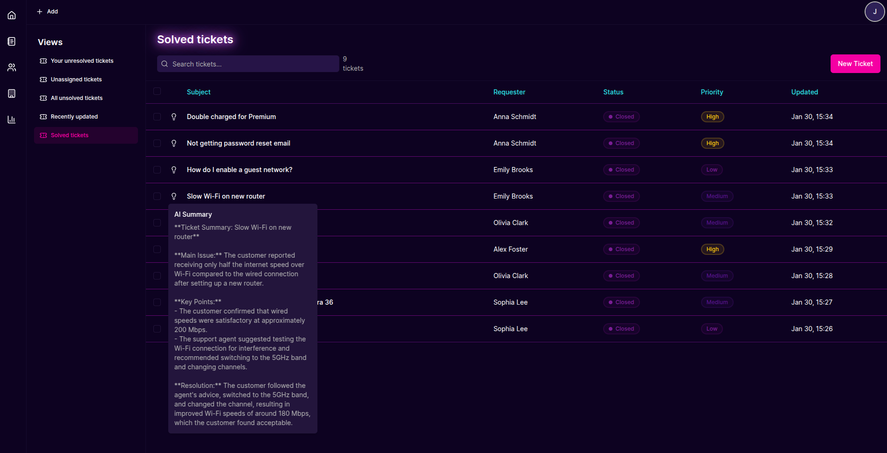
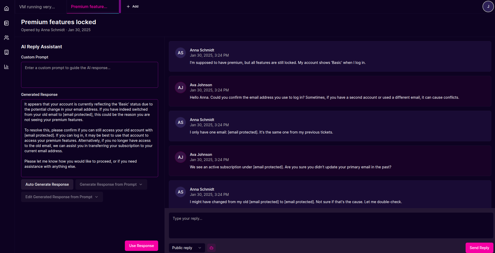
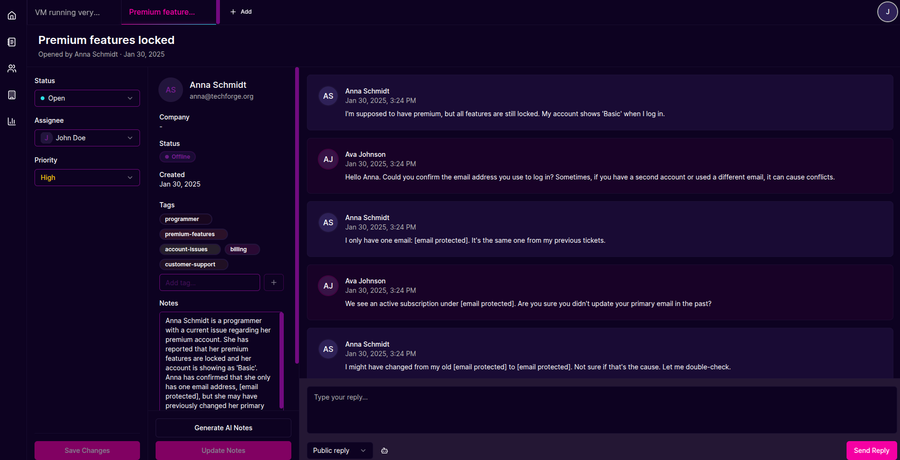
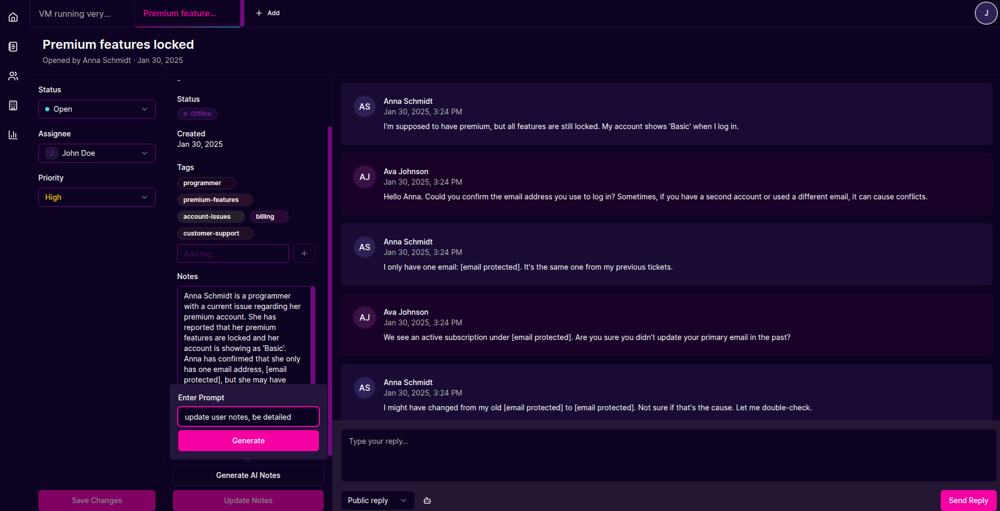
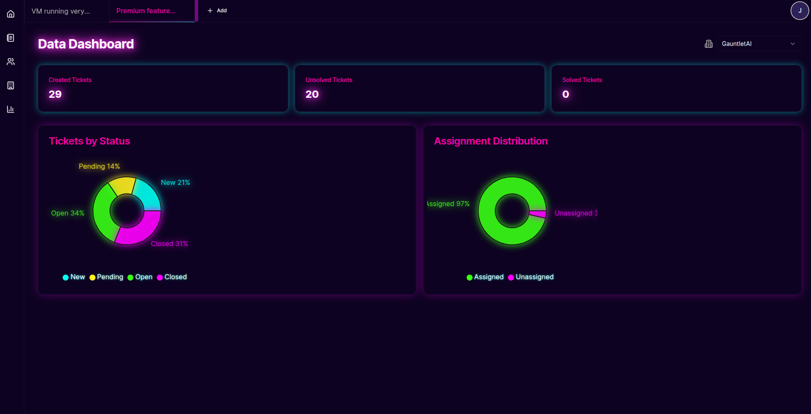
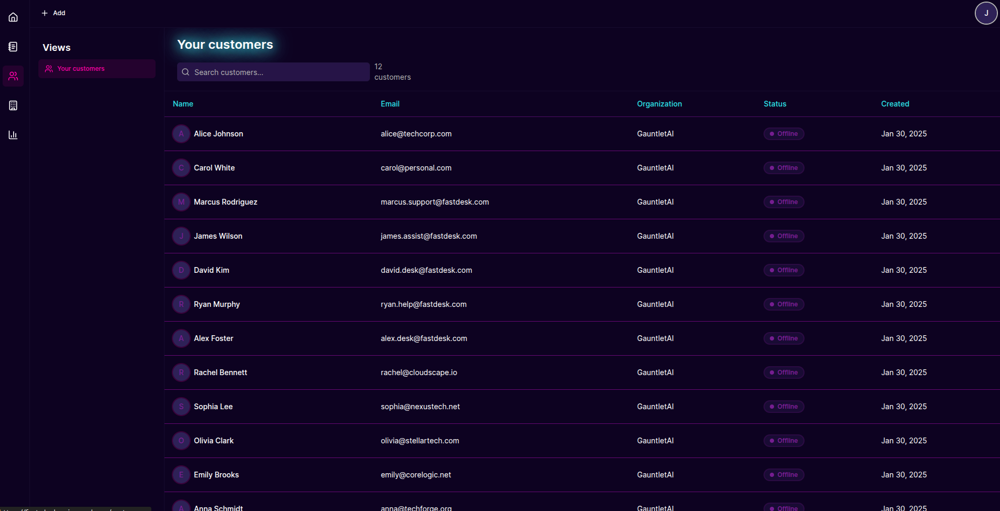
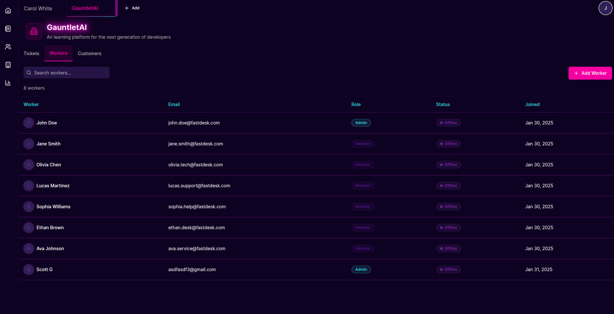
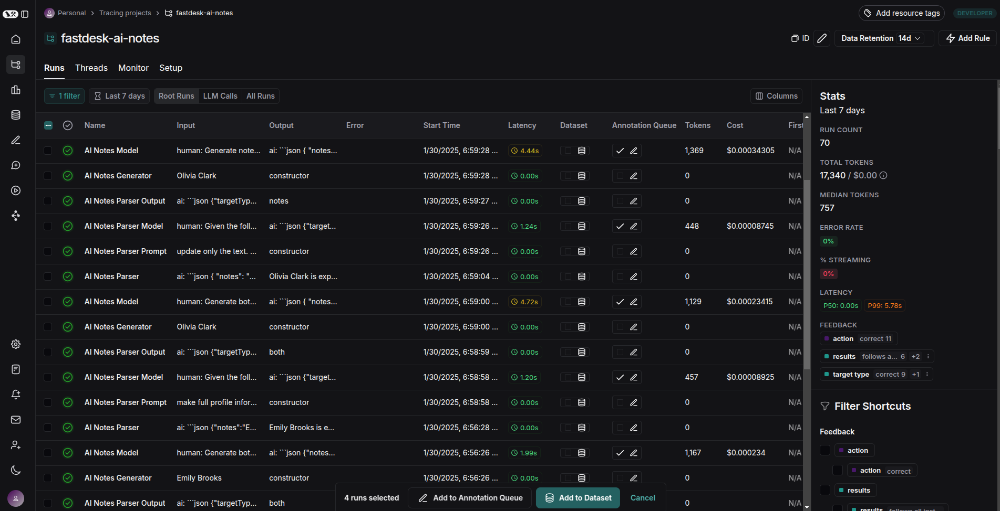
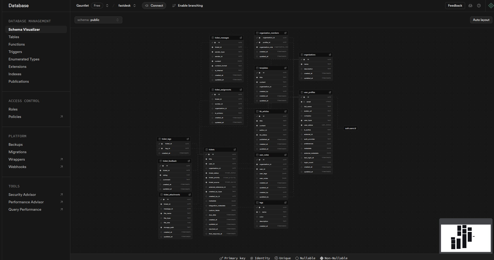

# FastDesk: AI-Powered Help Desk Solution

This project was created in 2-weeks as part of the GauntletAI program.

FastDesk is a modern, AI-enhanced help desk and customer support platform built with React, TypeScript, and Supabase. It streamlines customer support operations with intelligent ticket management, AI-assisted responses, and comprehensive analytics.

## Features

### Supabase Auth



### 🎫 Intelligent Ticket Management
Efficiently manage support tickets with a comprehensive view of all customer issues, prioritization, and status tracking.



### 🤖 AI-Powered Assistance
- **AI Reply Assistant**: Get intelligent response suggestions based on ticket context and history.
  
  

- **Note Generator**: Automatically generate structured notes from customer conversations.
  
  

- **Note Prompter**: Guide AI to create specific types of notes with customizable prompts.
  
  

### 📊 Data Analytics Dashboard
Track key performance metrics, ticket resolution times, and customer satisfaction scores.



### 👥 Customer & Organization Management
Maintain detailed profiles for customers and organizations for context-aware support.




### 📈 LangSmith Integration
Advanced tracing and monitoring of AI interactions for continuous improvement.



### 🔄 Supabase Backend
Robust database architecture with comprehensive data relationships.



## Tech Stack

- **Frontend**: React 18, TypeScript, Vite
- **Styling**: Tailwind CSS, Radix UI components
- **State Management**: Zustand, TanStack React Query
- **Backend**: Supabase (PostgreSQL, Authentication, Storage)
- **AI Integration**: LangChain, LangSmith
- **Form Handling**: React Hook Form, Zod validation
- **Testing**: Vitest, Testing Library

## Getting Started

### Prerequisites
- Node.js (v18+)
- npm or yarn
- Supabase account

### Installation

1. Clone the repository:
   ```bash
   git clone https://github.com/yourusername/fastdesk.git
   cd fastdesk
   ```

2. Install dependencies:
   ```bash
   npm install
   ```

3. Set up environment variables:
   - Copy `.env.example` to `.env.local`
   - Fill in your Supabase credentials and other required variables

4. Start the development server:
   ```bash
   npm run dev
   ```

5. Seed the database (optional):
   ```bash
   npm run seed
   ```

## Project Structure

The project follows a feature-based modular architecture (vertical slice):

```
fastdesk/
├─ src/
│  ├─ features/           # Feature modules (tickets, customers, etc.)
│  │  ├─ tickets/         # Example feature module
│  │  │  ├─ components/   # Feature-specific components
│  │  │  ├─ hooks/        # Feature-specific hooks
│  │  │  ├─ pages/        # Feature pages
│  │  │  ├─ services/     # API services
│  │  │  ├─ store/        # State management
│  │  │  └─ types.ts      # Feature-specific types
│  ├─ components/         # Shared UI components
│  ├─ layouts/            # Page layouts
│  ├─ providers/          # Context providers
│  ├─ routes/             # Application routing
│  ├─ store/              # Global state management
│  ├─ types/              # Global TypeScript types
│  └─ ...
├─ supabase/              # Supabase configuration and migrations
└─ ...
```


## Acknowledgements

- [Supabase](https://supabase.io/)
- [React](https://reactjs.org/)
- [Vite](https://vitejs.dev/)
- [Tailwind CSS](https://tailwindcss.com/)
- [Radix UI](https://www.radix-ui.com/)
- [LangChain](https://js.langchain.com/)
